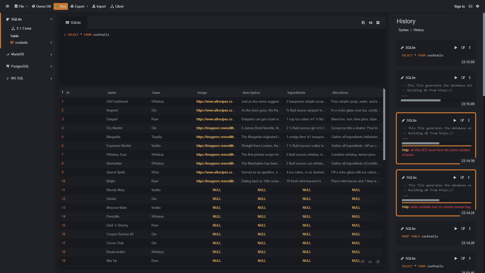

# A Plan of Attack!
This is for anyone curious how to approach this realistically. Here's my outline that I (would suggest you'd) follow for making this project.

## Benchmark Method
The easiest way to quit a project is to do too much too fast and to not have any project rest points in your development. For many, you may only finish the project after **all** of the features and testing and CI/CD and documentation have been added. That's not a good plan for longevity, so I propose what I call the Benchmark Method. I'm sure there's got a formal name somewhere for this approach (I refuse to be the first person to think of this).

This will help with issues of tracking progress. If there's a minimum viable product at each step, you'll have completed a project from the early stages and can comfortably walk away if you so choose; at least you'll have a completed program to show for the effort. Doing it all from A to Z rarely gets done. Having checkpoints in between will make this process more rewarding and feels better to continue working on.

### The Idea
- Basically, you start with the smallest reasonable MVP that you can create for this project. Whatever the point of the project is (in functionality), do it in the smallest and easiest way that can still be made into a program.
- In small steps, add the most to least necessary features for the project until you've fulfilled the complete feature set that you've made initially.
- Make sure each grouping of features will add to a complete program/project. These will be your goal posts to incrementally build to.


## Project Outline
*Heads up, I admittedly skipped steps that I would've wish I didn't in this process. Learn from my mistakes to have a smoother time!*


### SQLite Query Console App
Make a console app that:
- Asks the user for a search term on python
- Sends a query to SQLite
- Prints the results (if any) onto stdout

*Sidenote: I used SQLite because it's serverless and easier to throw together for this project. I ended up using https://sqliteonline.com/ for the simple entry knowledge and because SQLite's CLI/GUI were too confusing for what I needed. Look how beautiful and straightforward this is.*



### Implement Flask, slowly
- Add flask into the program
- Still ask user for query on console with Python
- Return the results into a page route (returned literally instead of a rendered template)
    - ```py
        query         = input(...)
        query_results = do_sql_query(query)

        @app.route
        def send_results():
            return query_results
        ```

### Get input through HTML
- Use GET/POST to capture the user input from one page and send to another.
    - Have a simple search bar and submit button. Nothing special
    - Use redirecting to move into the next page after the query is sent.

### Dress it up!
#### Option A: Using Figma and TailwindCSS
- Design your query page and results page on Figma and implement the design in code (preferrably with TailwindCSS)
    - Consider using [Awwwards](https://www.awwwards.com/), [Dribbble](https://dribbble.com/), and [Behance](https://www.behance.net/) to find inspiration for designs
    - Go to the [Figma page](./03_figma.md) of this docs site to see the designs I had before I started coding.

#### Option B: Using Bootstrap
- Similar, but not necessarily needing Figma. Consider designs that already exist to take inspiration from. The [Bootstrap Themes](https://themes.getbootstrap.com/) show some ideas that can be implemented through code. 

#### Option C: Using an HTML Template
- There are some websites that offer HTML Templates for free and paid pricing options. Finding two web pages out of the whole site design could be superfluous or useful depending on what you may need. 
